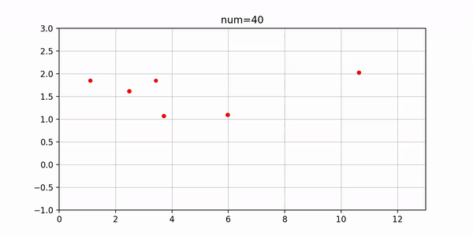
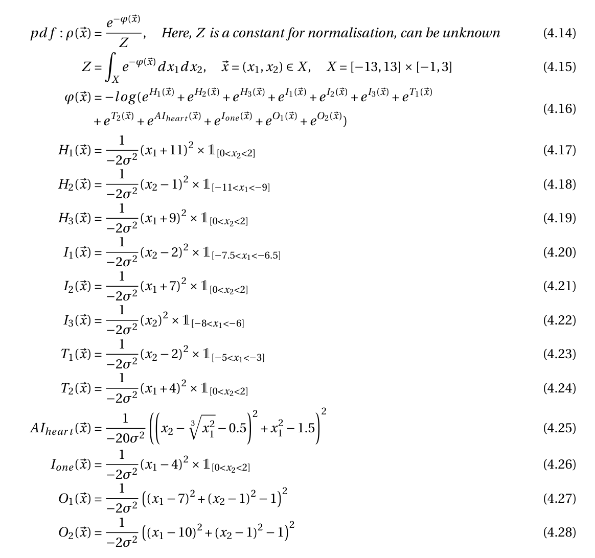
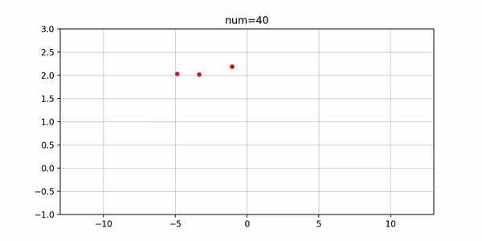

# Stochastic simulation project

- Parallel tempering Markov chain Monte Carlo(MCMC) algorithm
- Written in python, with dependency of scipy, numpy
- Generated random numbers following target distribution which is hard to explore its space otherwise
- We implemented different variants of the algorithm, investigated their efficiency, and compare them to a simple Random Walk Metropolis

The generated random number data is stored in data directory. Because the class parameter information used to generate data 
is also stored, the file is serialized into pickle file, which may not work in another computer. The first time running the program, you may need to regenerate 
data, after that you can plot the result multiple times without generating it again.

The plot figures are stored in figures directory.

### how to run it

for exercise 2,3,4, directly run `python Project_ex3` and so on in terminal or run `run -i Project_ex3` in notebook.

- animation of target distribution in exercise 3

## Interesting application

### say the words by 2D random vectors

You can define use the basic functions that represent the simple shape in 2D space to say some words.
For example, (x - a)^2 + (y - b)^2 - r^2 = 0 represents a circle with center (a, b) and radius r, \\
x - d = 0 and  m < y < n, represents a line segment from point (d, m) to (d, n). \\

Volia! Really simple, right? 

The next step is to define a function as f(x, y) = (x - a)^2 + (y - b)^2 - r^2, the contour line of f is group of concentric circles. Particularly, 
f(x,y) = 0 represents the circle above. Furthermore, define p(x,y) = exp(-/(2 * sigma^2) * f(x, y)), sigma is a small number(e.g., 0.05). 
p(x, y) has maximum of e at position of above circle. When (x,y) is far away from the circle, p decrease to 0 rapidly. 

That's it! p(x,y) is our target p.d.f. that represents the geometry we are interested to sample. You can define your custom distribution to say your desired words and use PM MCMC to generate random numbers that speak out for you.

Here is my own example, HIT 100! This year(2020) is the 100th anniversary of my bachelor university: Harbin Institue of Technology.

- target distribution

- animation of 10000 random vectors generated by PM MCMC 

